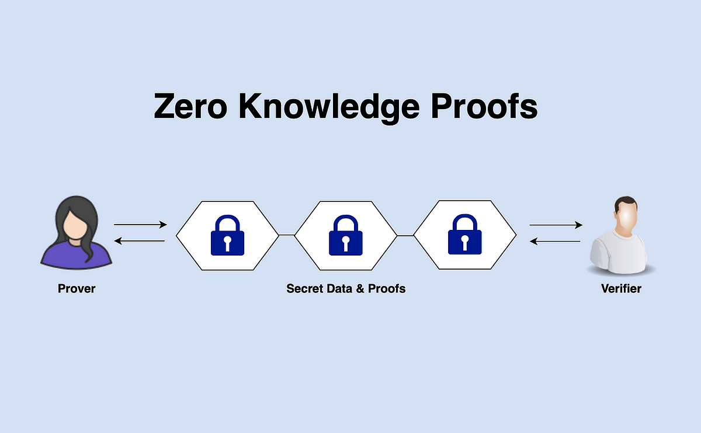

# Laporan Eksekutif: Analisis Komprehensif Teknologi Zero-Knowledge untuk Protokol ZKx401 di Solana

**Tanggal:** 30 Oktober 2025
**Penulis:** MiniMax Agent
**Status:** Final

---

## Ringkasan Eksekutif

Laporan ini menyajikan analisis komprehensif dan ringkasan strategis dari riset mendalam mengenai teknologi Zero-Knowledge (ZK) untuk ZKx401, sebuah ekstensi privasi yang diusulkan untuk protokol pembayaran HTTP-native x402 di blockchain Solana. Tujuan utama riset adalah untuk mengidentifikasi arsitektur teknis, tumpukan library, dan roadmap implementasi yang paling layak untuk mengintegrasikan fitur privasi yang kuat dan dapat diaudit tanpa mengorbankan performa dan efisiensi biaya yang menjadi ciri khas Solana.

**Temuan Kunci:**
1.  **zk-SNARKs sebagai Pilihan Pragmatis:** Untuk kebutuhan ZKx401 yang menuntut verifikasi on-chain berfrekuensi tinggi dan latensi rendah, **zk-SNARKs (khususnya Groth16)** direkomendasikan sebagai teknologi bukti utama. Keunggulannya terletak pada ukuran bukti yang sangat kecil (~128-288 bytes) dan waktu verifikasi yang sangat cepat (~10ms), yang krusial untuk menjaga batasan ukuran transaksi Solana (~1232 bytes) dan skalabilitas protokol pembayaran.
2.  **Primitif Privasi Solana Matang:** Solana telah mengembangkan fondasi yang kuat untuk implementasi ZK melalui `syscalls` `alt_bn128` (untuk verifikasi SNARK), `Poseidon` (untuk hash ZK-friendly), dan program `zk-token-proof`. Dua mekanisme privasi utama yang siap dimanfaatkan adalah:
    *   **Confidential Transfers (Ekstensi Token-2022):** Memberikan *privasi jumlah dan saldo* (amount privacy) menggunakan enkripsi ElGamal dan bukti ZK. Fitur ini sangat cocok untuk kasus penggunaan inti ZKx401, meskipun status aktivasinya di mainnet perlu dipantau secara ketat pasca-audit.
    *   **ZK Compression (Light Protocol):** Memberikan *privasi dan skalabilitas state* dengan mengurangi biaya penyimpanan akun secara drastis (hingga 5000x). Ini relevan untuk merchant atau layanan yang mengelola ledger berskala besar.
3.  **Stack Library Hibrida:** Alur kerja pengembangan yang paling efisien adalah hibrida. Untuk pengembangan dan pembuktian *off-chain* (client-side), stack berbasis JavaScript/TypeScript yang terdiri dari **`circom`** (desain sirkuit), **`snarkjs`** (prover/verifier), dan **`@zk-kit`** (primitif dan struktur data) direkomendasikan karena kemudahan integrasi dan kurva belajar yang landai. Untuk *on-chain*, verifikasi harus dilakukan dalam program **Rust** yang memanfaatkan `solana-zk-sdk` dan `syscalls` ZK untuk efisiensi maksimal.

**Rekomendasi Strategis:**
*   **Adopsi Awal zk-SNARKs:** Prioritaskan implementasi menggunakan zk-SNARKs (Groth16) untuk memenuhi kebutuhan performa ZKx401. zk-STARKs, meskipun menawarkan keuntungan dalam hal transparansi (tanpa trusted setup) dan ketahanan kuantum, memiliki ukuran bukti yang jauh lebih besar, menjadikannya kurang praktis untuk verifikasi on-chain yang sering di Solana saat ini.
*   **Fokus pada Confidential Transfers:** Mulai implementasi dengan mengintegrasikan fitur Confidential Transfers dari Token-2022 untuk memberikan privasi jumlah pembayaran. Ini adalah nilai jual privasi paling langsung dan berdampak bagi pengguna akhir x402.
*   **Implementasi Bertahap:** Ikuti roadmap implementasi bertahap:
    1.  **Tahap 1:** Integrasi **Confidential Transfers** untuk privasi jumlah.
    2.  **Tahap 2:** Implementasi **ZK Payment Proofs** untuk mode pembayaran `on-chain settlement` dan `deferred`.
    3.  **Tahap 3:** Pengembangan **Stealth Addresses** di lapisan aplikasi/dompet untuk privasi penerima (unlinkability).
    4.  **Tahap 4:** Riset lanjutan untuk solusi anonimitas tingkat jaringan (misalnya, DeCC/MPC) sebagai opsi jangka panjang.

**Langkah Selanjutnya:**
Langkah-langkah berikutnya yang harus segera diambil adalah memantau status re-aktivasi Confidential Transfers di mainnet Solana, memulai pengembangan pilot di devnet menggunakan stack library yang direkomendasikan, dan membangun pipeline audit keamanan yang ketat untuk semua komponen ZK yang dikembangkan.

---

## 1. Pendahuluan

Tujuan dari riset ini adalah untuk merumuskan strategi teknis yang komprehensif untuk "ZKx401," sebuah inisiatif untuk menyematkan fitur privasi berbasis Zero-Knowledge (ZK) ke dalam protokol pembayaran x402 di blockchain Solana. Protokol x402, yang menghidupkan kembali standar HTTP 402 "Payment Required", dirancang untuk menjadi jembatan antara interaksi web dan pembayaran on-chain yang stateless. Dengan mengintegrasikan ZK, ZKx401 bertujuan untuk menambahkan lapisan kerahasiaan pada transaksi pembayaran tanpa mengorbankan kecepatan, biaya rendah, dan skalabilitas yang menjadi keunggulan Solana.

Laporan ini menyatukan hasil dari beberapa analisis mendalam, mencakup perbandingan teknologi ZK (zk-SNARKs vs zk-STARKs), evaluasi library pengembangan, dan perumusan strategi implementasi yang selaras dengan ekosistem Solana dan SDK `@payai/x402-solana`. Hasil akhirnya adalah sebuah blueprint yang jelas untuk pengembangan, pengujian, dan peluncuran ZKx401.

---

## 2. Analisis Teknologi Zero-Knowledge

Pemilihan teknologi ZK yang tepat adalah fondasi dari keberhasilan ZKx401. Analisis difokuskan pada dua paradigma utama: zk-SNARKs dan zk-STARKs, serta ekosistem library yang mendukungnya.

### 2.1. Perbandingan: zk-SNARKs vs zk-STARKs

Analisis trade-off antara zk-SNARKs dan zk-STARKs sangat krusial bagi arsitektur ZKx401 di Solana, di mana efisiensi on-chain (ukuran bukti dan biaya verifikasi) adalah metrik utama.

*   **zk-SNARKs (Zero-Knowledge Succinct Non-Interactive Argument of Knowledge):** Menawarkan bukti yang sangat ringkas dan verifikasi yang sangat cepat. Varian seperti Groth16 menghasilkan bukti berukuran hanya ~128-288 bytes yang dapat diverifikasi dalam hitungan milidetik. Ini membuatnya sangat ideal untuk lingkungan on-chain seperti Solana yang memiliki batasan ukuran transaksi dan anggaran komputasi (Compute Units) yang ketat. Namun, kelemahannya adalah kebutuhan akan *trusted setup* per sirkuit (meskipun PLONK menawarkan *universal setup*) dan kerentanannya terhadap komputasi kuantum.

*   **zk-STARKs (Zero-Knowledge Scalable Transparent Argument of Knowledge):** Unggul dalam hal transparansi karena tidak memerlukan *trusted setup*, serta secara inheren tahan terhadap serangan komputer kuantum (quantum-resistant). Namun, ukuran buktinya jauh lebih besar (puluhan hingga ratusan kilobyte), yang secara langsung meningkatkan biaya verifikasi (CU) dan penggunaan data on-chain, menjadikannya kurang praktis untuk verifikasi tunggal berfrekuensi tinggi di L1 Solana saat ini.

**Tabel 1: Perbandingan Fundamental zk-SNARKs vs zk-STARKs**

| Aspek                  | zk-SNARKs (Groth16/PLONK)                       | zk-STARKs                                            | Implikasi untuk ZKx401 di Solana                               |
| ---------------------- | ----------------------------------------------- | ---------------------------------------------------- | ------------------------------------------------------------------ |
| **Ukuran Bukti**       | Sangat Kecil (`~100–300 Bytes`)                 | Besar (`~20–100+ KB`)                                | **SNARKs unggul** karena sesuai dengan batas transaksi Solana.      |
| **Waktu Verifikasi**   | Sangat Cepat (`~5-10 ms`)                       | Cepat (namun lebih lambat dari SNARKs)               | **SNARKs unggul** untuk throughput tinggi dan latensi rendah.       |
| **Trusted Setup**      | Diperlukan (risiko jika terkompromi)            | Tidak Diperlukan (Transparan)                        | STARKs lebih unggul dalam hal kepercayaan dan desentralisasi.     |
| **Ketahanan Kuantum**  | Rentan                                          | Tahan Kuantum                                        | STARKs adalah pilihan yang lebih future-proof.                    |
| **Biaya Verifikasi (CU)** | Rendah                                        | Tinggi (memerlukan batching untuk efisiensi)          | **SNARKs lebih ekonomis** untuk verifikasi per-transaksi.          |

**Rekomendasi:** Untuk fase awal ZKx401, **zk-SNARKs (Groth16)** adalah pilihan yang paling pragmatis. Ukuran bukti yang kecil dan verifikasi yang efisien secara langsung menjawab tantangan utama dalam implementasi di Solana.

### 2.2. Ekosistem Library ZK

Pipeline pengembangan ZK tipikal melibatkan desain sirkuit, generasi *witness*, pembuatan bukti (*proving*), dan verifikasi. Analisis kami merekomendasikan stack hibrida untuk menyeimbangkan kemudahan pengembangan dan performa produksi.

1.  **Circom:** Bahasa Domain-Spesifik (DSL) yang ditulis dalam Rust untuk mendefinisikan sirkuit aritmatika. Circom adalah standar industri de-facto untuk menulis sirkuit ZK dan memiliki ekosistem perkakas yang matang (misalnya, `circomlib` untuk template). **Peran: Desain Sirkuit.**

2.  **SnarkJS:** Implementasi JavaScript/WASM untuk zk-SNARKs yang kompatibel dengan sirkuit Circom. Library ini memungkinkan pembuatan bukti langsung di sisi klien (browser) atau server Node.js. Meskipun kinerjanya tidak secepat prover native (C++/Rust), kemudahan integrasinya menjadikannya pilihan ideal untuk pengembangan dan prototyping. **Peran: Off-chain Proving (Pengembangan).**

3.  **@zk-kit:** Sebuah monorepo library TypeScript yang menyediakan berbagai primitif ZK siap pakai, seperti hash Poseidon, dan struktur data penting seperti Incremental Merkle Trees (IMT). Ini mempercepat pengembangan aplikasi dengan menyediakan blok bangunan kriptografis yang telah diuji. **Peran: Primitif & Struktur Data.**

**Arsitektur yang Direkomendasikan:**
- **Pengembangan & Prototyping (Off-Chain):** Gunakan stack **`circom` + `snarkjs` + `@zk-kit`**. Alur ini memungkinkan developer membangun dan menguji logika ZK dengan cepat dalam lingkungan JavaScript/TypeScript yang familiar.
- **Produksi (On-Chain Verification):** Verifikasi bukti harus diimplementasikan dalam program **Rust** di Solana. Program ini akan memanfaatkan `solana-zk-sdk` dan `syscalls` ZK (`alt_bn128` dan `Poseidon`) untuk melakukan verifikasi on-chain yang sangat efisien. Bukti yang dibuat oleh `snarkjs` (off-chain) akan dikirim ke program Rust ini untuk divalidasi.

---

## 3. Strategi Implementasi ZKx401 di Solana

Strategi implementasi ZKx401 dirancang untuk memperluas fungsionalitas `@payai/x402-solana` dengan fitur privasi, sambil memastikan kompatibilitas dan arsitektur yang kuat.

### 3.1. Arsitektur Target

Arsitektur ZKx401 mempertahankan komponen inti x402 (klien, server API, fasilitator) dan memperluasnya untuk menangani bukti ZK.

-   **Klien:** Bertanggung jawab untuk membuat bukti ZK (misalnya, bukti validitas jumlah pembayaran rahasia) secara off-chain menggunakan `snarkjs` sebelum mengirim transaksi.
-   **Server API:** Menerapkan middleware x402 untuk menjaga resource dan memvalidasi persyaratan pembayaran.
-   **Fasilitator:** Perannya diperluas untuk meneruskan transaksi yang berisi bukti ZK ke program verifier on-chain.
-   **Program Solana (On-chain):** Program Rust khusus akan berfungsi sebagai verifier. Program ini menggunakan `syscalls` ZK untuk memvalidasi bukti yang diterima dan menjalankan logika yang sesuai (misalnya, mengizinkan transfer rahasia).

### 3.2. Pemanfaatan Primitif Privasi Solana

Dua mekanisme privasi utama di Solana menjadi pilar implementasi ZKx401:

1.  **Confidential Transfers (Token-2022):** Ekstensi ini memungkinkan enkripsi jumlah token dan saldo akun menggunakan skema kriptografi Twisted ElGamal dan bukti ZK (equality, range, ciphertext validity). Ini secara langsung menyediakan **privasi jumlah (amount privacy)**, yang merupakan inti dari pembayaran rahasia. Fitur ini juga menyertakan fungsionalitas *global auditor key* untuk kepatuhan (auditability).
2.  **ZK Compression (Light Protocol):** Mekanisme ini menggunakan bukti validitas Groth16 untuk memindahkan state dari akun Solana ke ledger off-chain yang lebih murah, dengan hanya menyimpan *state root* di on-chain. Ini memberikan **privasi dan skalabilitas state**, mengurangi biaya pembuatan dan pemeliharaan akun secara dramatis. Ini sangat relevan untuk layanan yang perlu mengelola jutaan akun pengguna (misalnya, saldo merchant).

### 3.3. Alur Pembayaran ZKx401

ZKx401 mendukung dua mode pembayaran utama:

-   **On-Chain Settlement:** Alur klasik di mana klien mengirimkan transaksi pembayaran (yang kini berisi bukti ZK) ke jaringan Solana. Akses ke resource diberikan setelah transaksi dan verifikasi bukti berhasil di L1. Mode ini memberikan finalitas segera.
-   **Deferred Payments:** Klien mengirimkan komitmen pembayaran yang diikat secara kriptografis (melalui HTTP Message Signatures) beserta bukti ZK. Server memberikan akses segera setelah memverifikasi komitmen tersebut, sementara penyelesaian finansial on-chain dapat ditunda atau dilakukan secara batch. Mode ini mengoptimalkan latensi untuk pengguna.

---

## 4. Roadmap Implementasi & Rekomendasi

Implementasi ZKx401 akan dilakukan secara bertahap untuk mengelola kompleksitas dan risiko.

### 4.1. Roadmap Bertahap

-   **Tahap 1: Fondasi Privasi Jumlah (Confidential Transfers)**
    *   **Fokus:** Mengintegrasikan ekstensi Token-2022 Confidential Transfer.
    *   **Tujuan:** Memberikan fitur inti pembayaran dengan jumlah rahasia.
    *   **Dependensi Kritis:** Memantau status re-aktivasi penuh fitur ini di mainnet Solana pasca-audit keamanan.

-   **Tahap 2: Bukti Pembayaran ZK (ZK Payment Proofs)**
    *   **Fokus:** Mengembangkan program verifier Rust on-chain dan memperluas SDK klien untuk mendukung alur *on-chain settlement* dan *deferred payments*.
    *   **Tujuan:** Mengaktifkan alur pembayaran privat yang fungsional secara end-to-end.

-   **Tahap 3: Privasi Penerima (Stealth Addresses)**
    *   **Fokus:** Mengimplementasikan skema *one-time addresses* di lapisan aplikasi/dompet untuk menyembunyikan identitas penerima.
    *   **Tujuan:** Meningkatkan *unlinkability* dan privasi metadata.

-   **Tahap 4: Eksplorasi Anonimitas Lanjutan**
    *   **Fokus:** Melakukan riset terhadap teknologi yang lebih canggih seperti komputasi terenkripsi (DeCC/MPC) untuk privasi eksekusi program.
    *   **Tujuan:** Menjajaki masa depan privasi total jika diperlukan.

### 4.2. Rekomendasi Teknologi

*   **Teknologi Bukti:** Gunakan **zk-SNARKs (Groth16)** untuk implementasi awal karena efisiensi on-chain yang superior di Solana.
*   **Stack Library:** Adopsi stack hibrida: **`circom`, `snarkjs`, `@zk-kit`** untuk pengembangan off-chain, dan **Rust dengan `solana-zk-sdk`** untuk verifikasi on-chain.
*   **Mekanisme Privasi:** Prioritaskan **Confidential Transfers (Token-2022)** sebagai mekanisme privasi inti. Evaluasi **ZK Compression** untuk kasus penggunaan spesifik yang memerlukan skalabilitas state.

### 4.3. Langkah Berikutnya

1.  **Validasi Ketersediaan:** Konfirmasi jadwal aktivasi dan ketersediaan penuh `syscall alt_bn128` dan fitur Confidential Transfer di Solana Mainnet.
2.  **Pengembangan Devnet:** Mulai pengembangan prototipe di devnet, fokus pada integrasi alur Confidential Transfer ke dalam SDK `@payai/x402-solana`.
3.  **Pipeline Keamanan:** Bangun pipeline untuk audit keamanan, termasuk analisis statis sirkuit, fuzzing pada program verifier, dan audit eksternal sebelum peluncuran mainnet.

---

## 5. Analisis Risiko dan Mitigasi

Implementasi teknologi ZK membawa risiko unik yang harus dikelola dengan cermat.

*   **Risiko Soundness Protokol:** Bug dalam logika sirkuit atau program verifier dapat memungkinkan pembuatan bukti palsu, seperti yang terjadi pada insiden "Phantom Challenge" di ZK ElGamal Proof Program Solana sebelumnya.
    *   **Mitigasi:** Audit kode yang sangat ketat oleh pihak ketiga, pengujian regresi yang ekstensif, dan peluncuran bertahap menggunakan *feature gates*.
*   **Risiko Operasional Trusted Setup:** Untuk Groth16, kompromi pada proses *trusted setup* dapat merusak keamanan seluruh sistem.
    *   **Mitigasi:** Melaksanakan seremoni *multi-party computation* (MPC) yang transparan dan dapat diverifikasi secara publik, serta mendokumentasikan seluruh prosesnya.
*   **Risiko Kinerja dan Biaya:** Verifikasi ZK on-chain mengonsumsi Compute Units (CU) yang signifikan.
    *   **Mitigasi:** Menggunakan zk-SNARKs yang efisien, mengoptimalkan sirkuit, dan menerapkan strategi seperti *deferred payments* atau *batching* untuk mengurangi beban on-chain.

---

## 6. Kesimpulan

ZKx401 memiliki potensi untuk menjadi standar de-facto pembayaran privat di ekosistem Solana dengan memanfaatkan kecepatan dan biaya rendah Solana yang dipadukan dengan jaminan privasi dari teknologi Zero-Knowledge. Analisis komprehensif ini menyimpulkan bahwa pendekatan yang paling pragmatis dan efektif adalah dengan **mengadopsi zk-SNARKs (Groth16) untuk efisiensi, memulai dengan implementasi Confidential Transfers (Token-2022) untuk privasi jumlah, dan mengikuti roadmap pengembangan bertahap yang memprioritaskan keamanan dan stabilitas.**

Dengan fondasi teknis yang kuat di Solana dan ekosistem library ZK yang matang, implementasi ZKx401 bukan hanya layak secara teknis tetapi juga strategis untuk membuka gelombang baru aplikasi web3 yang mengutamakan privasi pengguna.

---

## 7. Sumber

Berikut adalah daftar sumber eksternal yang menjadi rujukan utama dalam penyusunan laporan ini.

*   [1] **Chainlink:** ZK-SNARK vs ZK-STARK - Explained Simple - [https://chain.link/education-hub/zk-snarks-vs-zk-starks](https://chain.link/education-hub/zk-snarks-vs-zk-starks) - (Reliability: High - Educational content from a reputable oracle provider)
*   [2] **Consensys:** Zero-Knowledge Proofs: STARKs vs SNARKs - [https://consensys.io/blog/zero-knowledge-proofs-starks-vs-snarks](https://consensys.io/blog/zero-knowledge-proofs-starks-vs-snarks) - (Reliability: High - In-depth technical blog from a leading blockchain software company)
*   [3] **Helius:** Zero-Knowledge Proofs: Its Applications on Solana - [https://www.helius.dev/blog/zero-knowledge-proofs-its-applications-on-solana](https://www.helius.dev/blog/zero-knowledge-proofs-its-applications-on-solana) - (Reliability: High - Detailed technical guide from a major Solana infrastructure provider)
*   [4] **GitHub (iden3):** circom - zkSnark circuit compiler - [https://github.com/iden3/circom](https://github.com/iden3/circom) - (Reliability: High - Official repository for a core ZK tool)
*   [5] **GitHub (iden3):** snarkjs - zkSNARK implementation in JavaScript & WASM - [https://github.com/iden3/snarkjs](https://github.com/iden3/snarkjs) - (Reliability: High - Official repository for a core ZK library)
*   [6] **GitHub (privacy-scaling-explorations):** zk-kit - Monorepo of reusable ZK libraries - [https://github.com/privacy-scaling-explorations/zk-kit](https://github.com/privacy-scaling-explorations/zk-kit) - (Reliability: High - Official repository maintained by the Privacy & Scaling Explorations team)
*   [7] **Solana Docs:** ZK SDK Documentation - [https://docs.rs/solana-zk-sdk](https://docs.rs/solana-zk-sdk) - (Reliability: High - Official Rust crate documentation for the Solana ZK SDK)
*   [8] **Light Protocol:** ZK Compression Framework Documentation - [https://www.zkcompression.com/](https://www.zkcompression.com/) - (Reliability: High - Official documentation for the ZK Compression protocol)
*   [9] **ZK Security Blog:** Phantom Challenge Soundness Bug in Solana ZK Proof Program - [https://blog.zksecurity.xyz/posts/solana-phantom-challenge-bug/](https://blog.zksecurity.xyz/posts/solana-phantom-challenge-bug/) - (Reliability: High - Technical vulnerability disclosure from a reputable security firm)
*   [10] **QuickNode:** Confidential Transfers on Solana: A Developer's Guide - [https://www.quicknode.com/guides/solana-development/spl-tokens/token-2022/confidential](https://www.quicknode.com/guides/solana-development/spl-tokens/token-2022/confidential) - (Reliability: High - Developer guide from a major node provider)
*   [11] **GitHub (coinbase):** x402: A payments protocol for the internet - [https://github.com/coinbase/x402](https://github.com/coinbase/x402) - (Reliability: High - Official specification for the x402 protocol)
